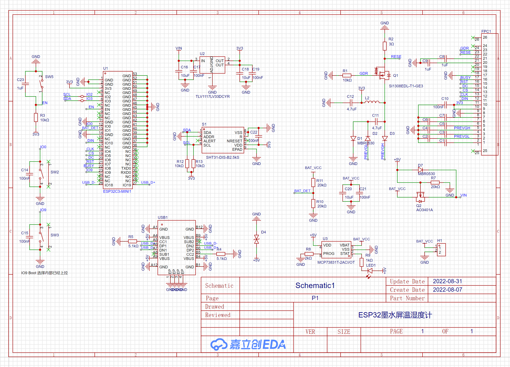
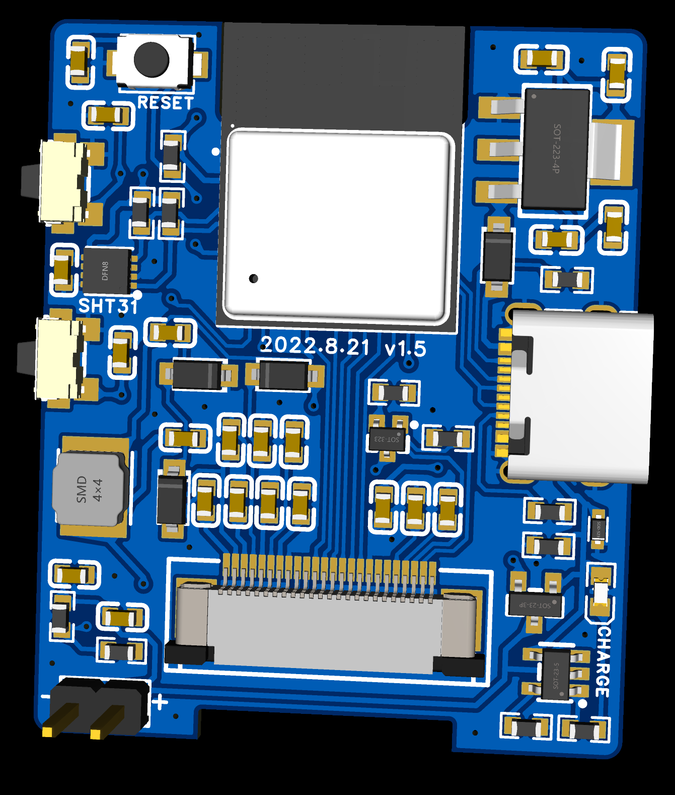
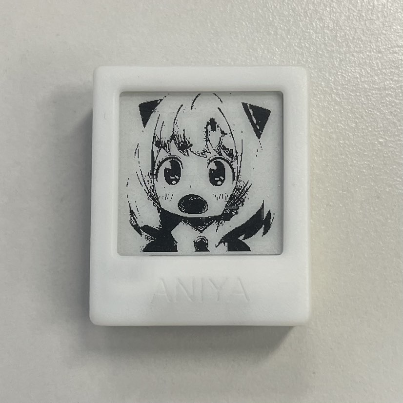
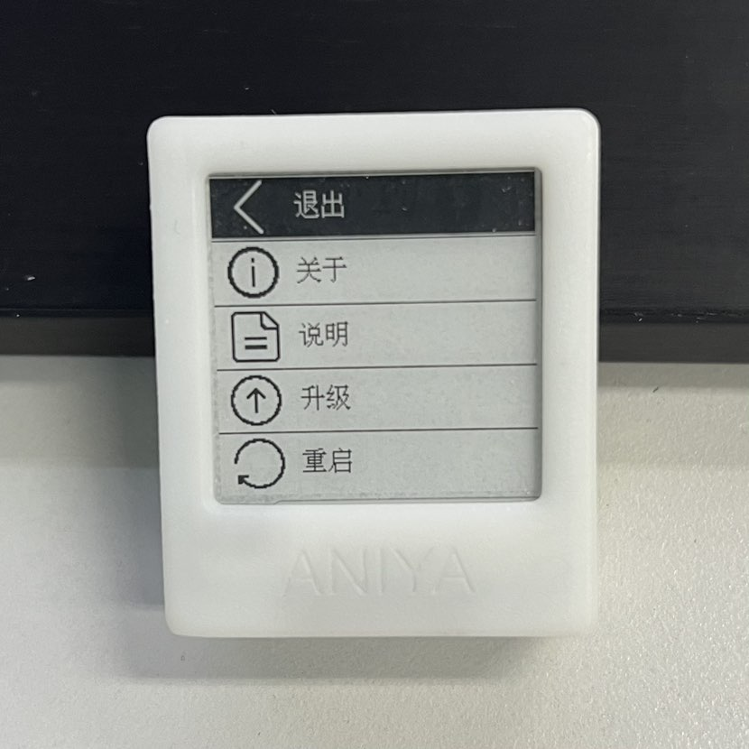
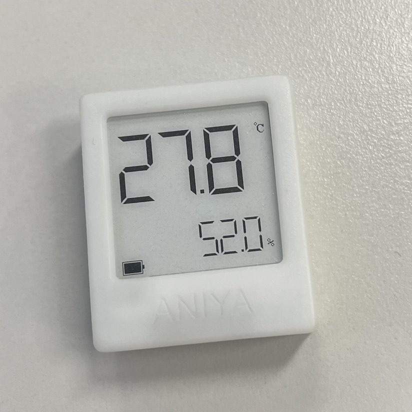
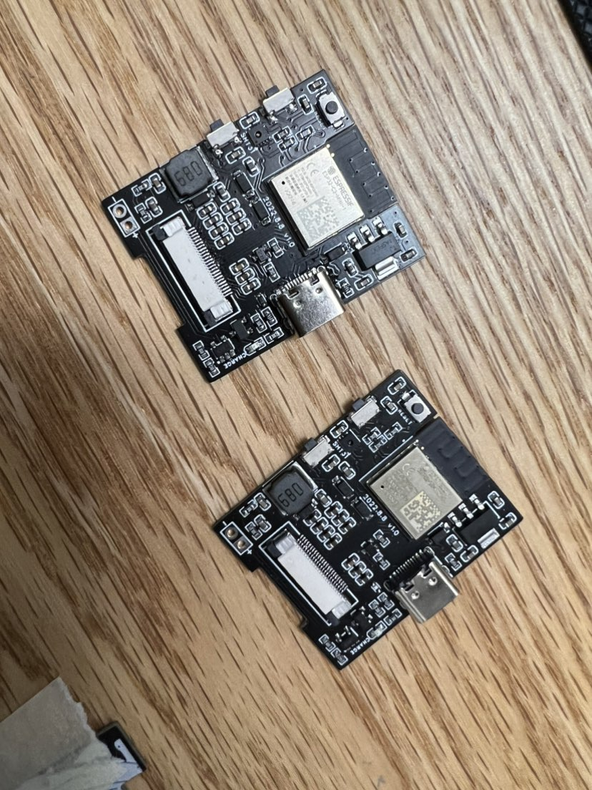

# Epd Aniya Box

`idf.py build`

`idf.py -p COM4 build flash monitor`

---
esp32墨水屏温湿度计, [主控esp32c3-mini](https://www.espressif.com/sites/default/files/documentation/esp32-c3-mini-1_datasheet_cn.pdf)(同样支持esp32 esp32s3)， 使用1.54英寸200*200墨水屏。

立创开源地址: 
[https://oshwhub.com/freedopm/aniya_epd](https://oshwhub.com/freedopm/aniya_epd)


200 * 200 [1in54 墨水屏裸屏尺寸](https://www.waveshare.net/shop/1.54inch-e-Paper.htm)（ssd1680）
- 1.2mm厚
- 显示区域 28mm
- 上左右黑边 1.9mm
- 下黑边 7.6mm
- 下排线预留 2mm
- 37.3 (+ 2mm) * 31.8

SPI LCD
- IO7 RST
- IO8 BUSY
- IO6 DC
- IO5 CS
- IO10 MOSI
- IO4 CLK

按键
- key 1 IO0
- key 2 IO9

温湿度传感器sht31 i2c
- SCL IO2
- SDA IO3

外壳  
外壳3d打印在box目录, 分别适用[3mm和6mm电池](https://item.taobao.com/item.htm?spm=a1z09.2.0.0.38452e8dEe6RPA&id=602110158806&_u=nvubg2g8ec5)   
3mm电池 30 * 35 * 30 使用3mm外壳 350mah  
6mm电池 30 * 35 * 60 使用6mm外壳 700mah

原理图    



截图




---
- [esp-idf](https://docs.espressif.com/projects/esp-idf/zh_CN/latest/esp32s3/get-started/index.html)

### 分区表

idf.py partition-table print


idf.py erase-flash

idf.py partition-table-flash: will flash the partition table with esptool.py.

idf.py flash: Will flash everything including the partition table.

### 词典支持
数据源 [ECDICT](https://github.com/skywind3000/ECDICT)    
处理脚本
```java
public static void csv() throws IOException {
    String csvFile = "/Users/yang/Downloads/ECDICT-master/ecdict.csv";

    Path dictPath = Paths.get("/Users/yang/Downloads/ECDICT-master/dict.csv");
    Path dictIndexPath = Paths.get("/Users/yang/Downloads/ECDICT-master/dict_index");

    int index = 0;
    int count = 0;
    try (Reader in = new FileReader(csvFile)) {
        Iterable<CSVRecord> records = CSVFormat.DEFAULT.parse(in);
        for (CSVRecord record : records) {
            if (record.get(7).contains("cet6")) {
                String res = record.get(0) + "|" // 单词
                        + record.get(1) + "|" // 音标
                        + record.get(3).replace("\\n", "\n")  + '\n'; // 中文意思

                byte[] recordBytes = res.getBytes("gbk");
                Files.write(dictPath, recordBytes,
                        StandardOpenOption.CREATE, StandardOpenOption.APPEND);

                byte[] byteIndex = new byte[2];
                byteIndex[0] = (byte) ((index >> 8) & 0xff);
                byteIndex[1] = (byte) (index & 0xff);

                index += recordBytes.length;

                Files.write(dictIndexPath, byteIndex,
                        StandardOpenOption.CREATE,
                        StandardOpenOption.APPEND);

                count++;
            }

            //if (count >= 800) { //TODO
            //    break;
            //}
        }
    } catch (IOException e) {
        e.printStackTrace();
    }
}
```
```xml
<dependency>
    <groupId>org.apache.commons</groupId>
    <artifactId>commons-csv</artifactId>
    <version>1.9.0</version>
</dependency>
```
